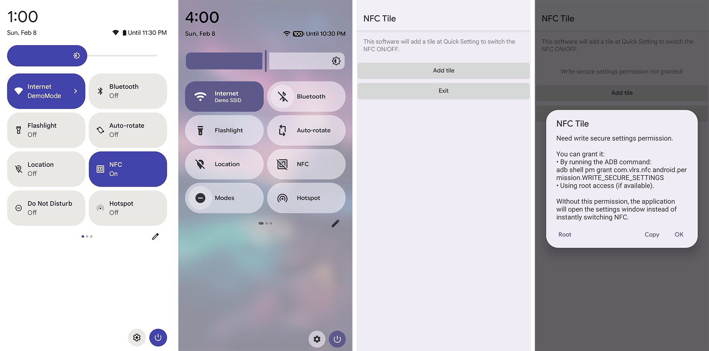

# Nfc Tile

A minimalist app to add an NFC tile to Android Quick Settings.

<picture>
  <source media="(prefers-color-scheme: dark)" srcset="screenshots_dark.png">
  <source media="(prefers-color-scheme: light)" srcset="screenshots_light.png">
  
</picture>

## Features

- **Minimal size** - ~12 KB for NoLauncher versions
- **Maximum mimicry** - the tile looks native on stock Android
- **No background processes** - works only when needed
- **Can work fully without Root** - just grant permission via ADB

## Why?

Primarily for stock Android devices (AOSP-based) like Google Pixel and others that lack a built-in NFC tile. If your device with an Android skin also doesn't have a system NFC tile, the app should work there too, though the icon may stand out slightly.

## Choosing a Version

| Version | Android | Features |
|---------|---------|----------|
| [**Regular**](../../releases/latest/download/NFC_Tile.apk) | 7.0+ (API&nbsp;24+) | Launcher icon, instruction dialog for granting permission |
| [**NoLauncher**](../../releases/latest/download/NFC_Tile_NoLauncher.apk) | 8.0+ (API&nbsp;26+) | No launcher icon, no instruction dialog |
| [**NoLauncher_New**](../../releases/latest/download/NFC_Tile_NoLauncher_New.apk) | 8.0+ (API&nbsp;26+) | Same as NoLauncher, but without subtitle. For Android 16+ with the new Quick Settings design. If your system tiles don't have "On/Off" subtitles, use this version. See screenshots for details |

**Note:** On Android 8-11, subtitles are not displayed in any version due to Android's own limitations. Subtitles are available starting from Android 12.

## Installation and Setup

### Step 1: Download

Download the required APK version by clicking the name in the table above or from the [Releases](../../releases) section.

### Step 2: Install APK

Install the downloaded file. For initial installation, use the **Regular** version.

### Step 3: Grant WRITE_SECURE_SETTINGS Permission

The app needs the `android.permission.WRITE_SECURE_SETTINGS` permission for instant NFC toggling - without it, the tile will redirect you to NFC system settings instead of toggling instantly. Successful permission grant is indicated by the instruction dialog disappearing when opening the regular version.

#### Option 1: Root (easiest)

1. Open the app
2. In the dialog, tap the **Root** button
3. Done!

#### Option 2: ADB (via computer)

1. Enable **Developer options** on your device
2. Enable **USB debugging**
3. On some devices (Oppo/Realme/OnePlus), you also need to enable **Disable Permissions Monitoring**
4. Download [Android Platform Tools](https://developer.android.com/tools/releases/platform-tools)
5. Connect your device to the computer and run:
```bash
adb shell pm grant com.vlrs.nfc android.permission.WRITE_SECURE_SETTINGS
```

After granting permission, you can safely turn off USB debugging, "Disable Permissions Monitoring", and Developer options.

#### Option 3: Without a computer (for advanced users)

If you can't connect to a PC:

- **[LADB](https://github.com/tytydraco/LADB)** - local ADB over Wi-Fi
- **[Shizuku](https://github.com/RikkaApps/Shizuku)** with [aShell](https://github.com/DP-Hridayan/aShellYou) or an app to grant permissions via Shizuku

After granting permission, you can safely turn off Wireless debugging, "Disable Permissions Monitoring", and Developer options.

### Step 4: (Recommended) Hide the Icon

#### For Android 7-9

1. Open the app
2. Enable the **Hide icon from Launcher** checkbox
3. Tap **Apply and Exit**

#### For Android 8-16+

After successfully granting permission, install **NoLauncher** (or **NoLauncher_New** for Android 16+) over the regular version.

### Step 5: Add the Tile to Quick Settings

Open Quick Settings, tap the pencil/edit icon, find the tile named **NFC** or **NFC Tile**, and drag it to your desired position.

## Usage

- **Short tap** - toggle NFC on/off (if permission granted)
- **Long press** - open NFC system settings
- **Tap without permission** - open NFC system settings

State indication (on/off) works even without granted permission.

## Source Code

The source code is not published separately because the app was originally written directly in [smali](https://github.com/JesusFreke/smali/wiki) assembly. Decompiling the APK with [ApkTool](https://apktool.org) will give you essentially the original project, except for auto-generated label names and a few missing comments.

## Credits

- **Nfc Switcher** (lack006) - inspired the main window design
- **Tiles** (rascarlo) - where I learned about using WRITE_SECURE_SETTINGS permission instead of root
